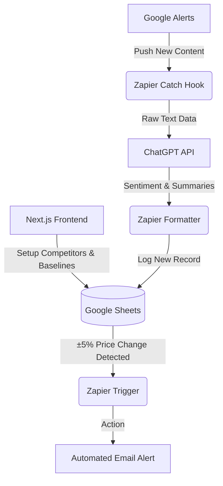

# BridgeLoop

# Milestone 1: Setup, Research, and Architecture
**Project Architecture Blueprint: AI-Assisted Competitive Intelligence**

## 1. Project Overview
BridgeLoop is an automated competitive tracking system. It leverages a **Decoupled Hybrid Architecture** to monitor competitors via Google Alerts, process data through ChatGPT for sentiment and pricing analysis, and store insights in Google Sheets. 

This architecture allows for rapid iteration using Zapier as the automation engine, enabling the team to validate the business logic immediately while dedicating 100% of the effort to building a robust Frontend UI (Next.js) for configuring these alerts and viewing data in the upcoming Milestone 2.

## 2. The Tech Stack
* **Frontend (Milestone 2 Focus)**: **Next.js** 
  *(Acts as the Competitor Profile Management interface where users securely enter competitor names, keywords, and baselines).*
* **Data Ingestion**: **Google Alerts** 
  *(Monitors the web for competitor names, product launches, and pricing updates).*
* **Automation & Logic**: **Zapier & ChatGPT API** 
  *(Zapier catches alerts and routes data. ChatGPT processes structured prompts to summarize updates, extract pricing, and classify sentiment).*
* **Storage & Processing**: **Google Sheets** 
  *(Stores baseline pricing, executes rule-based ±5% threshold formulas, and initially hosts the visual trend dashboard).*
* **Reporting**: **Canva** 
  *(Used to generate structured weekly insight reports based on the AI summaries).*

## 3. Architecture & Data Flow Mapping
**The "Config-to-Insight" Flow**

**Step-by-Step Data Journey:**
1. **Competitor Setup**: A user enters competitor details (name, target keywords, baseline pricing) on the Next.js Frontend.
2. **Alert Trigger**: Google Alerts (pre-configured) detects a keyword match and Zapier pulls the new alert.
3. **AI-Assisted Summarization**: Zapier sends the alert content to ChatGPT. ChatGPT generates a concise summary of the update, records any pricing mentions, and classifies sentiment (Positive, Neutral, Negative).
4. **Storage & Logic Detection**: The processed data is logged into **Google Sheets**. A formula dynamically compares the new price mention against the stored baseline value.
5. **Automated Tracking Alert**: If the threshold logic defines a "significant change" (e.g., a ±5% shift in pricing or a sudden spike in negative sentiment), Zapier triggers an immediate automated email notification to the team.
6. **Dashboard Review**: The Google Sheets trend dashboard updates to display the frequency of competitor updates, pricing change history, and sentiment distribution.

## 4. Automation & Threshold Rules
* **Pricing Tracking**: Baseline prices are manually stored during initial data entry. New mentions trigger a calculation comparing the previous vs current values.
* **Review Sentiment**: Publicly available excerpts are processed through structured prompts to classify as Positive, Neutral, or Negative to estimate weekly trend direction (instead of relying on a pre-trained enterprise machine learning model).

## 5. Security & System Limitations
* **UI Abstraction**: The Next.js API routes will secure webhook endpoints, ensuring public traffic cannot inject false configuration data into the pipeline.
* **Public Data Dependency**: The system strictly depends on publicly available Google Alerts and may not capture 100% of competitor activity. Pricing tracking depends solely on values explicitly mentioned in those alerts.
* **AI Interpretation**: Sentiment estimation and summarization are prompt-based. The system acknowledges that AI generated summaries may contain interpretation errors.
* **Scope Definition**: The dashboard is an assistive monitoring tool demonstrating automation and AI capabilities, not an enterprise-level competitive intelligence software.

---

## Appendix: Strategic Project Defense (Review Q&A)
*Crucial talking points for the project review.*

**The "Why"**
> "We are using Zapier, ChatGPT, and Google Sheets to handle the backend logic today so we can instantly validate our AI workflows. This allows us to focus 100% on the User Experience (UX) and Next.js Frontend design during Milestone 2. It allows us to pivot our AI prompts or threshold logic without rewriting backend server code."

**The "Next Step"**
> "For Milestone 2, we will be building out the high-fidelity UI to manage competitor profiles and live-testing the Zapier-to-ChatGPT AI triggers."
