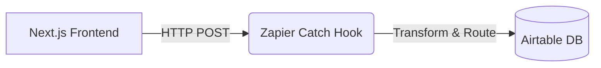
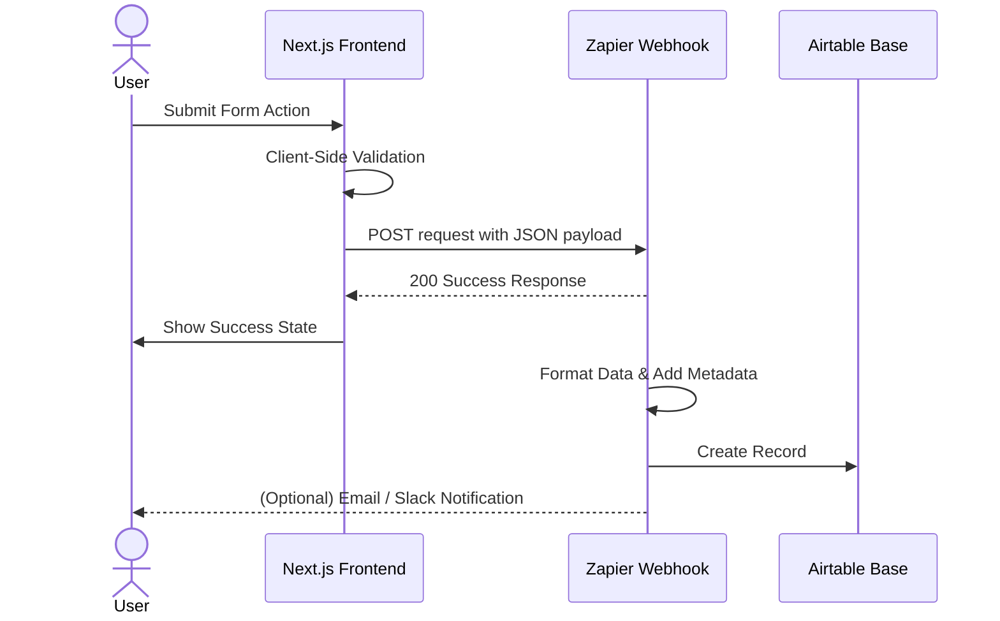

# BridgeLoop

# Milestone 1: Setup, Research, and Architecture
**Project Architecture Blueprint: Decoupled Hybrid Architecture**

## 1. Architecture Overview
**The "Frontend-to-Automation" Flow**



The system logic is built upon a **Decoupled Hybrid Architecture**. In this model, the client-side presentation layer (Frontend) is distinctly separated from the backend logic and database layer. Instead of immediately building and maintaining a custom monolithic backend, we are utilizing **Webhooks integrated with Zapier** to handle data routing, business logic, and database operations.

**Why Webhooks + Zapier is the Optimal Choice for a Scalable MVP:**
1. **Rapid Iteration**: Abstracting the backend logic into Zapier allows us to modify business rules, add integrations, and manipulate data flows visually without writing, testing, or deploying server-side code.
2. **Reduced Overhead**: It eliminates the need for managing server infrastructure, API gateways, and database connections during the critical early validation phases.
3. **Decoupled Scalability**: When the project outgrows Zapier in future milestones, the frontend remains entirely untouched; we simply point the existing webhooks to our new custom backend endpoints.

## 2. The Tech Stack
* **Frontend**: **Next.js** 
  *(Chosen for its robust ecosystem, performance optimizations, and seamless deployment capabilities (via Vercel), allowing for a highly polished, production-ready user interface).*
* **Logic/Integration**: **Zapier (via Catch Hooks)**
  *(Acts as the middleware controller, transforming and routing incoming requests instantly).*
* **Storage/Database**: **Airtable**
  *(Provides a flexible, relational database structure that is vastly superior to Google Sheets for managing exact data types, foreign keys, and scaling structured records).*

## 3. Data Flow Mapping
**The User Journey (Frontend to Database):**



1. **User Interaction**: The user fills out a form or triggers a core action on the Next.js frontend interface.
2. **Data Capture**: The frontend captures the input, synchronizes state, and constructs a formatted JSON payload.
3. **Transmission**: The frontend makes an asynchronous HTTP POST request (`fetch` or `axios`) containing the JSON payload securely to a unique **Zapier Catch Hook URL**.
4. **Processing (Zapier)**: 
   - The Catch Hook receives the payload instantly.
   - Zapier formats the data, applies any necessary conditional logic, and enriches it (e.g., adding timestamp metadata).
5. **Storage**: Zapier automatically maps and pushes the formatted data as a new record into the designated **Airtable** base and table.
6. **Post-Action (Optional)**: Zapier triggers an automated email response to the user or pings a Slack/Discord channel to notify the team of a successful entry.

## 4. API & Webhook Documentation
**Webhook Integration Specification**

* **Endpoint**: `[Provided by Zapier Catch Hook]`
* **Method**: `POST`
* **Content-Type**: `application/json`

**Expected JSON Payload Structure:**
```json
{
  "user_id": "uuid-1234-5678",
  "first_name": "Jane",
  "last_name": "Doe",
  "email": "jane.doe@example.com",
  "action_type": "form_submission",
  "payload_data": {
    "preferences": ["option_a", "option_c"],
    "message": "Interested in the beta program."
  },
  "metadata": {
    "source_url": "https://our-app.com/signup",
    "timestamp": "2026-04-01T12:00:00Z"
  }
}
```
*(Note: The Next.js frontend is responsible for ensuring this structure is strictly enforced prior to transmission).*

## 5. Security & Scalability
**Current MVP Security (Data Validation):**
- **Client-Side Validation**: All data will be strictly typed and validated on the frontend (e.g., using libraries like Zod or Yup) before the webhook is ever triggered. This prevents malformed data and limits bad inputs from hitting the Zapier pipelines.
- **Obscured Webhooks**: The Zapier hook URLs will be stored as environment variables (`.env`) in the Next.js project and executed via **Next.js API Routes** (Serverless Functions) to hide the specific Zapier destination URLs from the client's public browser inspector.

**Transition to Custom Backend (Milestone 3):**
The architecture is inherently built for scale. Because the frontend relies on generic, structured POST requests, transitioning to a custom backend (e.g., Node.js / Python) in Milestone 3 will require **zero major changes to the UI components**. We will simply update the Next.js API route to point to our newly deployed backend REST API instead of Zapier, successfully swapping out the middleware layer seamlessly.

---

## Appendix: Strategic Project Defense (Review Q&A)
*Crucial talking points for the review with Abhishek.*

**The "Why"**
> "We are using Zapier to handle the backend logic today so we can focus 100% on the User Experience (UX) and Frontend design during Milestone 2. It allows us to pivot the logic without rewriting server code."

**The "Next Step"**
> "For Milestone 2, we will be building out the high-fidelity UI and live-testing the Zapier triggers."
